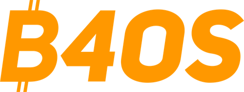

  

# Dashboard B4OS - GitHub Classroom

Sistema para sincronizar y visualizar challenges de GitHub Classroom con temática épica LOTR.

## Características

- **Dashboard épico** con tema LOTR y usuarios anónimos
- **Avatares temáticos** (Elfos, Enanos, Hobbits, Rangers, Magos)
- **Identidades anónimas** consistentes y determinísticas
- **Auto-identificación** mediante búsqueda de username real

## Temática LOTR

### Sistema de Anonimización
- **Nombres épicos**: `ElfRivendell_Star42A`, `DwarfErebor_Fire88C`
- **Determinísticos**: Mismo username = mismo nombre anónimo
- **Únicos**: Cada usuario tiene identidad única
- **Búsqueda**: Los usuarios pueden encontrar su alias buscando su username real

### Avatares Temáticos
- 🧝‍♂️ **Elfos**: Azules etéreos y violetas místicos
- 🏔️ **Enanos**: Oros cálidos y rojos de forja  
- 🌿 **Hobbits**: Verdes naturales de la Comarca
- 👑 **Rangers**: Colores nobles y reales
- 🧙‍♂️ **Magos**: Púrpuras mágicos

## Contribuciones

¡Gracias por tu interés en contribuir! Para conocer cómo configurar tu entorno de desarrollo, por favor consulta nuestra [Guía de Contribución](CONTRIBUTING.md).

## Stack Tecnológico

**Frontend**: Next.js + TypeScript + Tailwind CSS
**Autenticación**: NextAuth.js + GitHub OAuth
**Base de Datos**: PostgreSQL (Supabase)

## Licencia

Este proyecto está bajo la Licencia MIT. Consulta el archivo [LICENSE](LICENSE) para más detalles.

---

**Bitcoin 4 Open Source** - Programa gratuito de entrenamiento técnico en Bitcoin 🧡